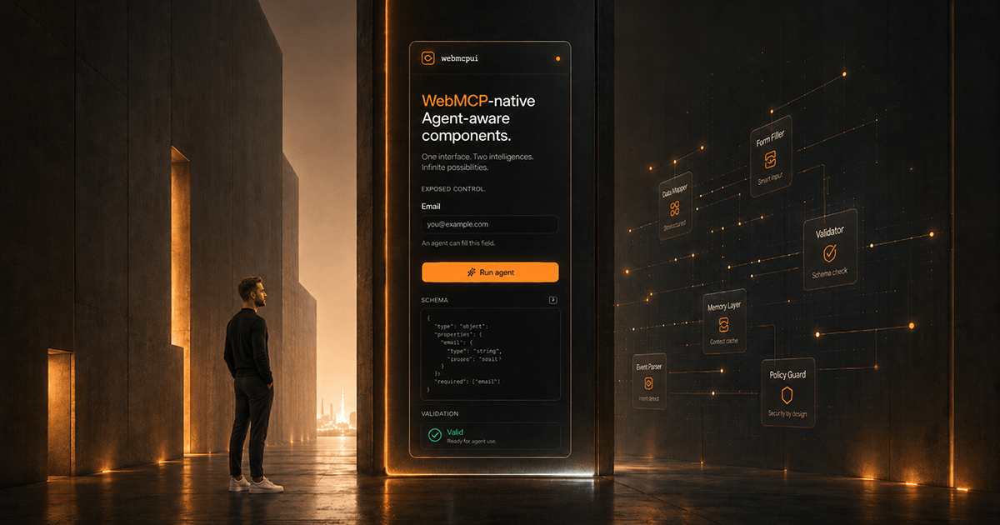

<a href="https://webmcpui.com">
  
</a>

# webmcpui

[](https://www.npmjs.com/package/@webmcpui/core)
[](https://jsr.io/@webmcpui/core)
[](./LICENSE)

Agent-aware, framework-agnostic web components for the WebMCP era — accessible, form-associated controls an AI agent can fill, with [Standard Schema](https://standardschema.dev) validation.

Each `<wmcp-*>` element is a great, accessible form control first. When a [WebMCP](https://webmcpui.com/docs/webmcp) host is present, it can also expose itself as a tool an AI agent can discover and call — feature-detected, so it's a zero-cost no-op everywhere else.

**[Documentation →](https://webmcpui.com/docs)** · **[Live demo →](https://webmcpui.com)**

## Install

**With a build tool** (Vite, Next, Nuxt, anything):

```bash
pnpm add @webmcpui/core @webmcpui/tokens
```

```ts
import { defineComponents } from '@webmcpui/core';
import '@webmcpui/tokens/css'; // theme tokens (CSS custom properties)

defineComponents(); // registers <wmcp-input>, <wmcp-select>, …
```

```html
<wmcp-input label="Email" name="email" type="email"></wmcp-input>
```

**No build step** (Webflow, WordPress, plain HTML) — one script tag, elements auto-register:

```html
<link rel="stylesheet" href="https://cdn.jsdelivr.net/npm/@webmcpui/tokens/dist/css/tokens.css" />
<script src="https://cdn.jsdelivr.net/npm/@webmcpui/core/dist/webmcpui.global.js"></script>

<wmcp-input label="Email" name="email" type="email"></wmcp-input>
```

**Deno / JSR:**

```bash
deno add jsr:@webmcpui/core
```

## Expose a control to an agent

Opt in with the `expose` attribute. The element registers a WebMCP tool on connect and removes it on disconnect:

```html
<wmcp-input label="Email" name="email" type="email" expose></wmcp-input>
<!-- registers a "fill_email" tool an agent can call -->
```

It's feature-detected against `document.modelContext` (the WebMCP API) — a complete no-op when no agent host is present, so the control is always a good form control first. See [the docs](https://webmcpui.com/docs/webmcp) for details.

## What ships

**Form controls** — expose a _value_ an agent can set. Form-associated (real `<form>` participation via `ElementInternals`), accessible, and Standard Schema-validatable:

`<wmcp-input>` · `<wmcp-textarea>` · `<wmcp-select>` · `<wmcp-checkbox>` · `<wmcp-radio-group>`

**Interaction primitives** — expose an _action_ an agent can trigger (or, for toast, a _reading_ an agent can perceive):

`<wmcp-button>` · `<wmcp-dialog>` · `<wmcp-menu>` · `<wmcp-tabs>` · `<wmcp-popover>` · `<wmcp-toast>`

## Packages

| Package | Registry | What |
| --- | --- | --- |
| [`@webmcpui/core`](packages/core) | [npm](https://www.npmjs.com/package/@webmcpui/core) · [JSR](https://jsr.io/@webmcpui/core) | The custom elements (built on [Lit](https://lit.dev)) |
| [`@webmcpui/tokens`](packages/tokens) | [npm](https://www.npmjs.com/package/@webmcpui/tokens) | Design tokens — CSS custom properties, TS, Figma |

This is a pnpm + Turborepo monorepo; the [webmcpui.com](https://webmcpui.com) site lives in [`apps/web`](apps/web).

## Status

WebMCP is early — in a public origin trial in Chrome 149+ — and the API surface is still shifting. Everything here is additive and feature-detected, so adopting webmcpui costs nothing today and lights up as hosts ship. Expect breaking changes before 1.0.

## License

[MIT](./LICENSE) © Gary Pfaff (Pfaff Digital)
